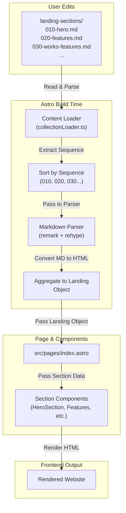

# Content Management System - Implementation Plan

## Architecture Overview

This system replaces the single `src/content/landing/index.md` with a new content collection structure:

- **Current:** Single monolithic YAML file with all page data
- **New:** Individual Markdown files per section with sequence-based ordering
- **Benefit:** Easy user editing, web-search friendly, supports dynamic ordering

## System Architecture Diagram



## File Structure

### 1. New Content Collection Directory

Create: `src/content/landing-sections/`

```
src/content/landing-sections/
├── 010-hero.md
├── 020-features.md
├── 030-works-features.md
├── 040-use-cases.md
├── 050-testimonials.md
├── 060-pricing.md
├── 070-faq.md
├── 080-cta.md
└── 090-footer.md
```

Each file follows the naming pattern: `[SEQUENCE]-[section-name].md`

- **Sequence numbers** (010, 020, 030, etc.) control order on the frontend
- **Section names** are descriptive and lowercase
- Files are processed in ascending sequence order

### 2. Astro Content Collections Configuration

Update `src/content/config.ts` to register the new collection:

- Add `landing-sections` collection schema
- Define types for frontmatter (title, description, seo, structured data, etc.)
- Enable Markdown parsing with remark/rehype plugins

### 3. Content Loader Utility

Create: `src/lib/loaders/landing-sections-loader.ts`

This utility:
- Reads all files from `landing-sections/` collection
- Extracts sequence numbers from filenames
- Sorts files by sequence (lowest first)
- Parses Markdown body to HTML
- Aggregates all sections into a single landing object
- Returns data in the same format as current `src/content/landing/index.md`

**Key function signature:**
```typescript
export async function loadLandingSections(): Promise<LandingContent>
```

Returns an object matching the current landing page structure with all sections populated.

### 4. Section File Templates

Each section file (e.g., `010-hero.md`) follows this structure:

```markdown
---
# METADATA
id: hero
title: "Hero Section"
description: "Main landing page hero section"

# SEO
seo:
  metaTitle: "Your Headline | Brand Name"
  metaDescription: "150-160 character description for search results"
  keywords:
    - "keyword1"
    - "keyword2"

# STRUCTURED DATA (component-specific, varies per section)
badge:
  label: "🔥 New"
  text: "Introducing AI Agent v2"

primaryCta:
  label: "Get Started"
  href: "/register"
---

# Hero Section Content

## Main Headline Here

Write rich, formatted content here. Use **bold**, *italic*, and [links](https://example.com).

### Supporting Copy

This Markdown will be converted to HTML and rendered in the frontend.


```

### 5. Updated Astro Page

Modify: `src/pages/index.astro`

- Replace `getCollection('landing')` with the new loader utility
- Maintains same component structure and rendering logic
- No changes needed to existing section components (backward compatible)

## Data Flow

1. **Build Time:**
   - Astro reads all files from `src/content/landing-sections/`
   - Loader extracts metadata and sorts by sequence number
   - Markdown body is parsed to HTML using remark + rehype
   - Structured frontmatter data + parsed HTML are aggregated
   - Result passed to `src/pages/index.astro`

2. **Rendering:**
   - Index page receives landing object with all section data
   - Each section component receives its data and renders
   - Markdown HTML is rendered within components
   - Dynamic ordering happens automatically (edit sequence numbers to reorder)

## Section Templates (9 Total)

Each template will be SEO-optimized and user-friendly:

1. **010-hero.md** - Main hero section with badge, CTA, stats
2. **020-features.md** - Feature cards with descriptions
3. **030-works-features.md** - How it works with steps
4. **040-use-cases.md** - Use cases with tabs and testimonials
5. **050-testimonials.md** - User testimonials/social proof
6. **060-pricing.md** - Pricing plans comparison
7. **070-faq.md** - FAQ items (searchable)
8. **080-cta.md** - Call-to-action section with stats
9. **090-footer.md** - Footer links and newsletter signup

Each template includes:
- Clear YAML frontmatter with all needed fields
- Rich Markdown body with headings, emphasis, links
- SEO meta fields (title, description, keywords)
- Placeholder content showing expected format
- Comments explaining best practices

## Implementation Steps

### Phase 1: Setup (Files & Configuration)
- Create `src/content/landing-sections/` directory
- Update `src/content/config.ts` with collection schema
- Create remark/rehype pipeline configuration

### Phase 2: Build Loader Utility
- Create `src/lib/loaders/landing-sections-loader.ts`
- Implement sequence-based file sorting
- Implement Markdown-to-HTML parsing
- Implement data aggregation logic

### Phase 3: Create Section Templates
- Create all 9 section Markdown files (010-090)
- Populate with current data from `src/content/landing/index.md`
- Add SEO fields and rich formatting

### Phase 4: Update Astro Page
- Modify `src/pages/index.astro` to use new loader
- Verify all components still render correctly
- Test dynamic ordering (rename files to reorder sections)

### Phase 5: Documentation & Cleanup
- Create editing guide for users
- Archive old `src/content/landing/index.md` (or remove if confident)
- Test complete build and rendering

## Key Features Implemented

✓ **Sequence-based ordering** - Change filename numbers to reorder sections  
✓ **Web-search friendly** - SEO meta fields, proper heading hierarchy  
✓ **User-friendly editing** - Standard Markdown format, intuitive templates  
✓ **Rich formatting** - Headers (H2/H3/H4), bold, italics, links, images  
✓ **Backward compatible** - Existing components work without changes  
✓ **Scalable** - Easy to add new sections or pages later  
✓ **Type-safe** - Full TypeScript support for frontmatter schema  

## Technology Stack

- **Astro Content Collections** - File-based CMS
- **remark** - Markdown parser
- **rehype** - HTML transformer
- **TypeScript** - Type safety for schemas
- **Existing components** - No rewrite needed

## Files to Create/Modify

**Create:**
- `src/content/landing-sections/010-hero.md` through `090-footer.md`
- `src/lib/loaders/landing-sections-loader.ts`
- `src/lib/loaders/markdown-parser.ts` (remark/rehype config)

**Modify:**
- `src/content/config.ts` - Add collection schema
- `src/pages/index.astro` - Update to use new loader

**Keep (No changes):**
- `src/components/sections/**` - All section components
- `src/pages/**` - All other pages
- `src/layouts/**` - All layouts

## Expected Outcomes

After implementation:
- Users can edit individual section Markdown files
- Each file has clear frontmatter for structured data
- Markdown body renders as formatted HTML on the frontend
- Changing file sequence numbers automatically reorders sections
- Bold text, links, headings, and images all render correctly
- SEO meta fields available per section
- Complete backward compatibility with existing components