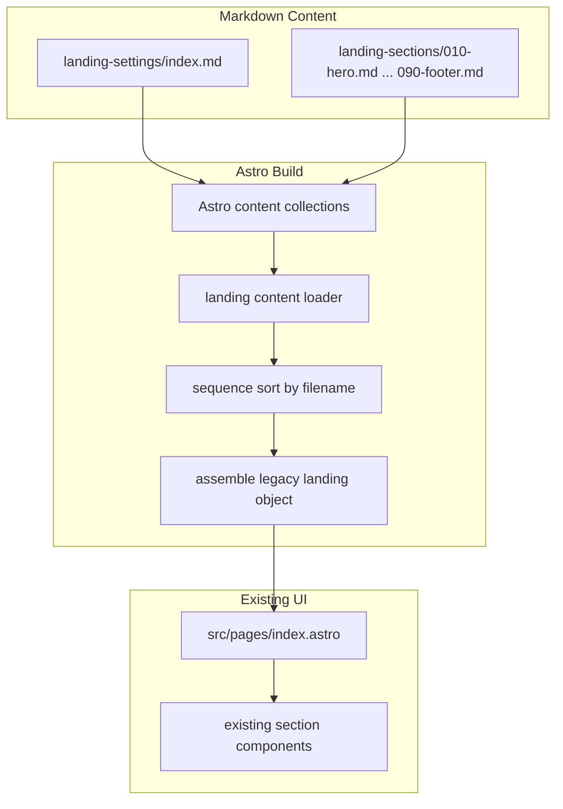

# Content Management System - Implementation Plan

## Goal

Implement a fast, safe Phase 1 content system for the existing landing page by splitting content into section-based Markdown files while preserving the current live page design, layout, and component structure.

## Core Decision

This plan now follows a narrowed approach:

- **Do now:** Structured Markdown files with YAML frontmatter per section, loaded into the existing landing page.
- **Do not do now:** Generic freeform Markdown rendering across all sections, preview pages, or component redesign.
- **Reason:** The current page design is already acceptable, and the priority is faster content editing with minimal frontend risk.

## Current Reality In The Codebase

- The live page currently reads one monolithic content object from `src/content/landing/index.md`.
- Astro content collections are configured in `src/content.config.ts`, not `src/content/config.ts`.
- The current section components expect structured fields and plain strings, not arbitrary HTML or freeform Markdown bodies.
- The fastest safe migration path is to preserve the current data shape and only change where the content comes from.

## Target Architecture

### Content Sources

Use two content areas:

1. **Global landing settings**
   - File: `src/content/landing-settings/index.md`
   - Holds page-level content such as:
     - `seo`
     - `integrations`

2. **Section-based landing content**
   - Directory: `src/content/landing-sections/`
   - One Markdown file per section:

```text
src/content/landing-sections/
+-- 010-hero.md
+-- 020-features.md
+-- 030-works-features.md
+-- 040-use-cases.md
+-- 050-testimonials.md
+-- 060-pricing.md
+-- 070-faq.md
+-- 080-cta.md
+-- 090-footer.md
```

### Rendering Model

- The live route `/` continues using the existing section components.
- A loader assembles settings + ordered section files into the same `landing` object shape the page already expects.
- The page and section components should keep the same visible output.
- Any component changes made during implementation must be limited to compatibility fixes, not redesign.

### Assembled Output Type

The loader must return the same shape currently consumed by `src/pages/index.astro`.

Reference shape:

```ts
type LandingContent = {
  seo: {
    title: string
    description: string
    keywords: string
    siteName: string
  }
  integrations?: {
    formId?: number
    bookingCalendarId?: number
    bookingEventId?: number
    standaloneBookingUrl?: string
  }
  hero: {
    badge: { label: string; text: string }
    title: [string, string]
    description: string
    primaryCta: { label: string; href: string }
    secondaryCta: { label: string; href: string }
    usersText: string
    ratingText: string
    tabs: Array<{
      value: 'lead-qualifier' | 'meeting-prep' | 'follow-ups' | 'data-sync' | 'reporting' | 'content-drafting'
      name: string
    }>
  }
  features: {
    title: string
    description: string
    cards: Array<{ title: string; description: string }>
  }
  worksFeatures: {
    title: string
    description: string
    steps: Array<{
      id: 'describe-workflow' | 'connect-tools' | 'review-and-refine'
      title: string
      description: string
    }>
  }
  useCases: {
    title: string
    description: string
    heading: string
    learnMoreLabel: string
    tabs: Array<{
      name: string
      value: 'sales' | 'marketing' | 'founders'
      image: string
      title: string
      description: string
      link: string
      testimonials: Array<{ id: string; review: string }>
    }>
  }
  testimonials: {
    title: string
    description: string
    items: Array<{
      id: string
      avatar: string
      fallback: string
      name: string
      designation: string
      companyName: string
      companyLogo: string
      companyLogoDark?: string
      message: string
    }>
  }
  pricing: {
    title: string
    description: string
    heading: string
    subheading: string
    monthlyLabel: string
    yearlyLabel: string
    yearlySaveLabel: string
    plans: Array<{
      name: string
      description: string
      price: number
      yearlyPrice: number
      currency: string
      period: string
      features: string[]
      buttonText: string
      buttonVariant: 'primary' | 'secondary'
    }>
  }
  faq: {
    title: string
    description: string
    heading: string
    subheading: string
    docsButton: { label: string; href: string }
    contactButton: { label: string; href: string }
    leftColumnTitle: string
    rightColumnTitle: string
    items: Array<{ question: string; answer: string }>
  }
  cta: {
    heading: string
    description: string
    primaryCta: { label: string; href: string }
    secondaryCta: { label: string; href: string }
    stats: Array<{
      number: number
      pointNumber?: number
      suffix: string
      description: string
    }>
  }
  footer: {
    newsletterTitle: string
    newsletterDescription: string
    newsletterInputPlaceholder: string
    newsletterButtonLabel: string
    links: Array<{
      title: string
      links: Array<{ title: string; href: string }>
    }>
    copyrightSuffix: string
  }
}
```

## Data Flow



## File Structure And Responsibilities

### 1. Astro Content Configuration

Modify `src/content.config.ts`:

- keep existing `landing` collection temporarily during migration
- add `landingSettings` collection
- add `landingSections` collection
- define strict schemas for both

### 2. Global Settings File

Create `src/content/landing-settings/index.md`

Responsibilities:
- store page-level SEO fields
- store integration IDs and URLs
- stay small and stable

### 3. Section Markdown Files

Create one file per section in `src/content/landing-sections/`

Responsibilities:
- hold only the structured fields needed by the current UI
- remain editor-friendly and easy to scan in Obsidian
- support image path editing without requiring UI changes
- keep section IDs and filenames stable

Required filename convention:

- filenames must start with a three-digit numeric prefix such as `010`, `020`, `030`
- filenames must remain unique
- the numeric prefix is the only ordering source in Phase 1
- section `id` values must remain stable even if content changes
- the filename slug must match the intended section identity
- the loader must enforce filename slug to frontmatter `id` matching for required sections

Examples:

- `010-hero.md` must contain `id: hero`
- `020-features.md` must contain `id: features`
- `030-works-features.md` must contain `id: works-features`

### 4. Landing Loader

Create `src/lib/loaders/landing-sections-loader.ts`

Responsibilities:
- read `landingSettings` and `landingSections`
- sort section files by numeric filename prefix
- validate required sections
- assemble the final object into the same shape currently used by `src/pages/index.astro`

Expected signature:

```ts
export async function loadLandingContent(): Promise<LandingContent>
```

### 5. Live Landing Page

Modify `src/pages/index.astro`

Responsibilities:
- stop reading the old monolithic `landing` entry
- read the assembled object from `loadLandingContent()`
- keep the component tree and page layout unchanged

## Content Modeling Rules For Phase 1

### Rule 1: Structured Frontmatter First

Each section file should use YAML frontmatter for all fields consumed by the current components.

Example:

```md
---
id: hero
title:
  - "Work with AI agent"
  - "that handles your daily operations"
description: "Automate routine tasks, connect your tools, and let your AI agent coordinate workflows."
badge:
  label: "New"
  text: "Introducing AI Agent"
primaryCta:
  label: "Get Started"
  href: "/register"
secondaryCta:
  label: "View Pricing"
  href: "#pricing"
usersText: "12K+ Users"
ratingText: "4.5 Ratings"
tabs:
  - value: "lead-qualifier"
    name: "Lead Qualifier"
---
```

### Rule 2: Markdown Body Is Optional, Not Foundational

Section files may include a Markdown body for human readability, notes, or future use, but Phase 1 should **not** rely on generic body-to-HTML rendering for the live page.

That means:

- the frontend should not depend on arbitrary Markdown body output
- the live landing page should remain driven by structured frontmatter
- body content should be treated as optional and non-blocking unless a later phase explicitly adopts it

### Rule 3: Preserve Existing Data Contracts

The assembled output must preserve the current content shape for:

- `hero`
- `features`
- `worksFeatures`
- `useCases`
- `testimonials`
- `pricing`
- `faq`
- `cta`
- `footer`
- global `seo`
- global `integrations`

### Rule 4: Image Paths Must Be Direct And Existing

Phase 1 image handling is path-based only.

- image values in Markdown files must use root-relative public paths such as `/images/use-cases/01.webp`
- those paths must resolve to existing assets under `public/images/...`
- Phase 1 does not include uploads, asset ingestion, image processing, or media management UI
- missing image files should fail validation during implementation checks

## Validation Strategy

Validation is split between Astro collection schemas and the custom landing loader.

### Astro Collection Schema Validation

Use `zod` schemas in `src/content.config.ts` to validate:

- required scalar fields
- nested object shape
- arrays and expected lengths where appropriate
- enum-like values such as hero tab values, use-case values, step IDs, and pricing button variants
- numeric integration IDs

Recommended schema style:

```ts
const heroTabValue = z.enum([
  'lead-qualifier',
  'meeting-prep',
  'follow-ups',
  'data-sync',
  'reporting',
  'content-drafting'
])
```

```ts
const sequenceFilenamePattern = /^\d{3}-[a-z0-9-]+\.md$/
```

### Loader Validation

Use the loader for cross-file validation that collection schemas cannot safely enforce alone:

- missing required section entry
- duplicate numeric filename sequence
- mismatch between filename slug and frontmatter `id`
- duplicate section `id`
- missing image assets referenced by path
- final assembled object completeness

## Section Inventory

### Global File

- `landing-settings/index.md`
  - `seo`
  - `integrations`

### Section Files

1. `010-hero.md`
2. `020-features.md`
3. `030-works-features.md`
4. `040-use-cases.md`
5. `050-testimonials.md`
6. `060-pricing.md`
7. `070-faq.md`
8. `080-cta.md`
9. `090-footer.md`

## Exact Section Contracts

These field contracts are the execution baseline for Phase 1. The new Markdown files must map to these exact shapes so the current page and section components continue to work.

### `src/content/landing-settings/index.md`

Required fields:

- `seo.title`
- `seo.description`
- `seo.keywords`
- `seo.siteName`

Optional fields:

- `integrations.formId`
- `integrations.bookingCalendarId`
- `integrations.bookingEventId`
- `integrations.standaloneBookingUrl`

### `src/content/landing-sections/010-hero.md`

Required fields:

- `id`
- `badge.label`
- `badge.text`
- `title` as an array of exactly 2 strings
- `description`
- `primaryCta.label`
- `primaryCta.href`
- `secondaryCta.label`
- `secondaryCta.href`
- `usersText`
- `ratingText`
- `tabs`

Tab item contract:

- `value`
- `name`

Allowed tab values:

- `lead-qualifier`
- `meeting-prep`
- `follow-ups`
- `data-sync`
- `reporting`
- `content-drafting`

### `src/content/landing-sections/020-features.md`

Required fields:

- `id`
- `title`
- `description`
- `cards`

Card item contract:

- `title`
- `description`

Expected count:

- exactly 5 cards

### `src/content/landing-sections/030-works-features.md`

Required fields:

- `id`
- `title`
- `description`
- `steps`

Step item contract:

- `id`
- `title`
- `description`

Allowed step IDs:

- `describe-workflow`
- `connect-tools`
- `review-and-refine`

Expected count:

- exactly 3 steps

### `src/content/landing-sections/040-use-cases.md`

Required fields:

- `id`
- `title`
- `description`
- `heading`
- `learnMoreLabel`
- `tabs`

Tab item contract:

- `name`
- `value`
- `image`
- `title`
- `description`
- `link`
- `testimonials`

Allowed tab values:

- `sales`
- `marketing`
- `founders`

Testimonial item contract inside each tab:

- `id`
- `review`

Expected count:

- exactly 3 tabs

### `src/content/landing-sections/050-testimonials.md`

Required fields:

- `id`
- `title`
- `description`
- `items`

Item contract:

- `id`
- `avatar`
- `fallback`
- `name`
- `designation`
- `companyName`
- `companyLogo`
- `message`

Optional item fields:

- `companyLogoDark`

### `src/content/landing-sections/060-pricing.md`

Required fields:

- `id`
- `title`
- `description`
- `heading`
- `subheading`
- `monthlyLabel`
- `yearlyLabel`
- `yearlySaveLabel`
- `plans`

Plan item contract:

- `name`
- `description`
- `price`
- `yearlyPrice`
- `currency`
- `period`
- `features`
- `buttonText`
- `buttonVariant`

Allowed `buttonVariant` values:

- `primary`
- `secondary`

### `src/content/landing-sections/070-faq.md`

Required fields:

- `id`
- `title`
- `description`
- `heading`
- `subheading`
- `docsButton.label`
- `docsButton.href`
- `contactButton.label`
- `contactButton.href`
- `leftColumnTitle`
- `rightColumnTitle`
- `items`

FAQ item contract:

- `question`
- `answer`

### `src/content/landing-sections/080-cta.md`

Required fields:

- `id`
- `heading`
- `description`
- `primaryCta.label`
- `primaryCta.href`
- `secondaryCta.label`
- `secondaryCta.href`
- `stats`

Stat item contract:

- `number`
- `suffix`
- `description`

Optional stat fields:

- `pointNumber`

### `src/content/landing-sections/090-footer.md`

Required fields:

- `id`
- `newsletterTitle`
- `newsletterDescription`
- `newsletterInputPlaceholder`
- `newsletterButtonLabel`
- `links`
- `copyrightSuffix`

Footer section contract:

- `title`
- `links`

Footer link item contract:

- `title`
- `href`

## What We Are Implementing Now

These items are in scope for the immediate implementation:

- Split landing content into one Markdown file per section.
- Add one small global settings Markdown file.
- Add Astro collection schemas for the new content sources.
- Build a loader that assembles the new files into the current landing object shape.
- Switch the live landing page to use the new content source.
- Preserve the current frontend look and section component structure.
- Allow content, links, and image paths to be edited from the Markdown files.
- Support section ordering through filename prefixes such as `010`, `020`, `030`.
- Add an editing guide for future content changes.

## Work Deferred For Later

These ideas stay in the plan as intentional future work, but are **not** part of Phase 1:

### Rich Markdown Rendering

- Generic Markdown-to-HTML rendering for section body content
- Rich text rendering inside headings, descriptions, FAQ answers, pricing details, or card descriptions
- Support for arbitrary embedded Markdown structures in every section

### Preview And Publishing Workflow

- Separate preview/staging route
- Draft/published workflow
- Editorial approval flow
- Change review UI

### Broader CMS Features

- Adding completely new section types without code support
- A generic block-based page builder
- Image upload/management UI
- Inline editing UI
- Version history inside the site

### Advanced SEO And Schema

- Per-section SEO behavior that materially affects rendered page metadata
- Section-level schema generation
- Search-oriented content enrichment beyond current page metadata

## Obsidian Editing Conventions

Phase 1 is optimized for frontmatter-first editing in Obsidian.

- every section file should begin with clean YAML frontmatter
- optional Markdown body content is allowed for editor notes or future use
- the optional body is ignored by Phase 1 live rendering
- each section should have one canonical example/template during implementation
- editors should primarily modify properties in frontmatter, not invent new fields ad hoc

## Loader Validation Behavior

The loader must fail fast with clear errors when required content is invalid.

Build-failing conditions:

- missing `landing-settings/index.md`
- missing required section file
- duplicate filename sequence
- filename without a valid three-digit numeric prefix
- duplicate section `id`
- section `id` that does not match the intended section file
- required field missing from frontmatter
- enum-like value outside the allowed set
- image path that points to a missing required asset

Validation messaging requirements:

- error messages must identify the exact file involved
- error messages should identify the exact field when possible
- errors should make it obvious whether the fix is filename-related or frontmatter-related

## Pause List

These items are paused because they need clearer design or would slow down delivery:

1. Freeform Markdown body rendering on the live page
2. Preview page architecture
3. Generic "any section can render anything" CMS behavior
4. Automatic support for newly invented section layouts
5. UI/editor tooling beyond Markdown files

## Risks To Handle During Phase 1

### Content Validation Risks

- missing required section file
- duplicate filename sequence
- invalid or missing section `id`
- missing required fields inside frontmatter

### Content Editing Risks

- broken image paths
- malformed YAML
- accidental filename renaming that changes order
- deletion of a required section

### Migration Risks

- assembled object shape drifting from the current `landing` shape
- page-level settings being lost during the split
- accidental frontend behavior change while switching data source

## Implementation Phases

### Phase 1: Foundation

- Create `landing-settings` and `landing-sections`
- Add schemas in `src/content.config.ts`
- Define exact section IDs and required fields

### Phase 2: Loader

- Build `loadLandingContent()`
- Sort by filename prefix
- Map each section file into the current landing object shape
- Add validation errors for missing required sections

### Phase 3: Migration

- Move existing dummy content from `src/content/landing/index.md` into the new files
- Preserve current text, links, and image paths first
- Clean up formatting so the files are readable in Obsidian
- complete a field-by-field content audit to ensure no existing landing data is dropped during the split

### Phase 4: Live Switch

- Update `src/pages/index.astro` to use the new loader
- Keep the current component tree unchanged
- Verify that the live page still looks the same

### Phase 5: Documentation And Cleanup

- Write editor instructions
- Keep the old monolithic file temporarily during validation if useful
- Remove or archive the old file only after the new system is confirmed stable

## Migration Rule For The Old Monolithic File

The old file `src/content/landing/index.md` is a migration source only.

- During implementation, it may remain in the repo while the new Markdown files are created and compared
- Once `src/pages/index.astro` is switched to `loadLandingContent()`, the live page must no longer read from the old `landing` collection
- After the new system is verified, the old monolithic file should be archived or removed to avoid split-source confusion

## Files To Create

- `src/content/landing-settings/index.md`
- `src/content/landing-sections/010-hero.md`
- `src/content/landing-sections/020-features.md`
- `src/content/landing-sections/030-works-features.md`
- `src/content/landing-sections/040-use-cases.md`
- `src/content/landing-sections/050-testimonials.md`
- `src/content/landing-sections/060-pricing.md`
- `src/content/landing-sections/070-faq.md`
- `src/content/landing-sections/080-cta.md`
- `src/content/landing-sections/090-footer.md`
- `src/lib/loaders/landing-sections-loader.ts`
- documentation note for editing guidance

## Files To Modify

- `src/content.config.ts`
- `src/pages/index.astro`

## Files To Keep Unchanged If Possible

- `src/components/sections/**`
- `src/components/blocks/**`
- `src/layouts/**`

## Success Criteria For Phase 1

The implementation is successful when:

- the live landing page uses the new Markdown-backed content source
- the visible frontend design remains effectively unchanged
- all landing sections render with the same data structure as before
- text, links, and image paths can be edited from section Markdown files
- global SEO and integration settings still work
- section order is controlled by filename sequence
- invalid content fails fast with understandable build errors

## Testing And Verification

Use a lightweight verification flow for Phase 1:

- run the project build after schema and loader integration
- manually compare the live landing page before and after the switch to confirm no visible design regression
- rename one section prefix during testing to confirm ordering changes as expected
- intentionally break one required field in a section file during testing to confirm validation fails with a useful error
- verify at least one image path from migrated content resolves correctly on the live page

Rollback rule:

- if the live page breaks after switching to the new loader, temporarily point `src/pages/index.astro` back to the old monolithic source until the data-shape mismatch is fixed

## Expected Outcome

After Phase 1:

- the landing page will still look like the current frontend
- the content will be easier to edit in smaller Markdown files
- Obsidian-friendly section files will replace the monolithic content file
- the project will have a clear list of future CMS enhancements without blocking the initial delivery
